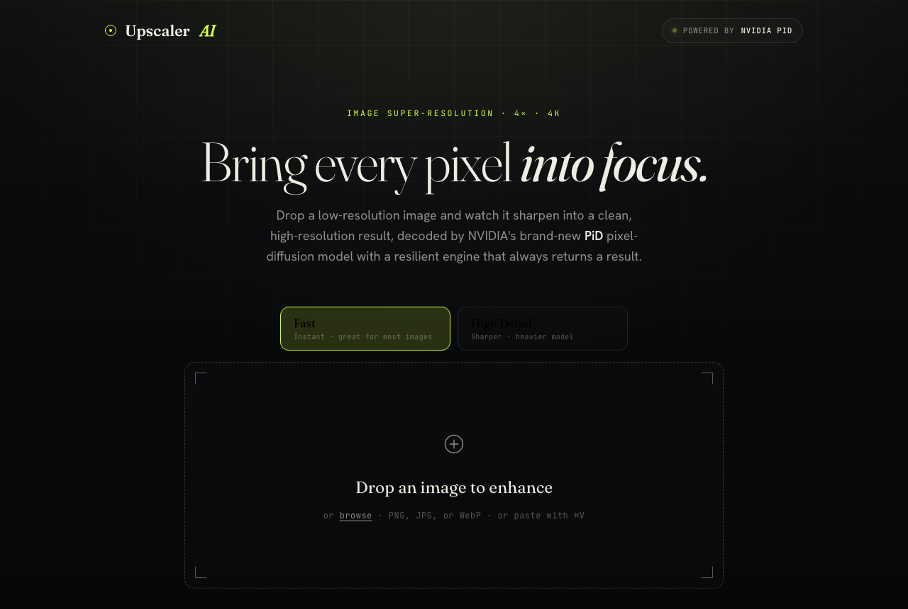

<div align="center">

# Upscaler AI

**Free AI Image Upscaler, powered by NVIDIA PiD**

*Drop a low-resolution image, get a crisp, 4K-grade result in seconds. Right in your browser, nothing to install, nothing stored.*


[Live Demo](https://natekali.github.io/imgupscaler/) | [Features](#-features) | [How It Works](#-how-it-works) | [Quick Start](#-quick-start) | [Privacy](#-privacy) | [Deploy](#%EF%B8%8F-deploy)



</div>

---

<details>
<summary><strong>Table of Contents</strong></summary>

- [What is Upscaler AI](#what-is-upscaler-ai)
- [Features](#-features)
- [How It Works](#-how-it-works)
- [Privacy](#-privacy)
- [Quick Start](#-quick-start)
- [Deploy](#%EF%B8%8F-deploy)
- [Optional: the PiD GPU tiers](#optional-the-pid-gpu-tiers)
- [Tech Stack](#-tech-stack)
- [Credits](#-credits)
- [License](#-license)

</details>

---

## What is Upscaler AI

Upscaler AI is a dead-simple web app for image super-resolution: you drop in a small or blurry
image and it returns a sharp, high-resolution version at up to 4x. It is headlined by NVIDIA's
brand-new **[PiD](https://research.nvidia.com/labs/sil/projects/pid/)** ("Pixel Diffusion Decoder")
model, and it is engineered so the result **always comes back**, even when no GPU is available.

The whole front end is a static site on GitHub Pages. The default engine runs **entirely in your
browser**, so for most images you do not need a server or a GPU at all.

---

## ✨ Features

| | Feature |
|---|---|
| 🧠 | **NVIDIA PiD** diffusion upscaling (optional GPU tier) with a resilient failover chain |
| ⚡ | **Runs in your browser** by default. No account, no upload to a server, no cost |
| 🎚️ | **Two quality modes**: Fast (instant) and High Detail (sharper, heavier model) |
| 🪟 | **Before / after slider** to inspect the result at a glance |
| 🫧 | **Transparency preserved** for PNGs (alpha is upscaled separately) |
| 💾 | **Download** as PNG or JPG, with the output file size shown |
| 📋 | Drag and drop, click to browse, **or paste an image** with Cmd/Ctrl+V |
| 🛑 | **Cancel** any run mid-process |
| 🔒 | **Zero storage**: images are processed in memory and never persisted |

---

## 🧠 How It Works

Free GPU capacity is scarce, so a single backend would inevitably show "busy" under load. Instead,
the browser walks a **failover chain** and stops at the first engine that returns a result:

| Tier | Engine | Role |
|------|--------|------|
| **1** | NVIDIA **PiD** on [Modal](https://modal.com) (serverless GPU) | Reliable primary. Free credits, CORS, secret stays server side |
| **2** | NVIDIA **PiD** on a [Hugging Face ZeroGPU Space](https://huggingface.co/docs/hub/spaces-zerogpu) | Free, best effort accelerator |
| **3** | **Real-ESRGAN x4** via [onnxruntime-web](https://onnxruntime.ai/docs/tutorials/web/) (WebGPU, WASM) | In-browser floor. Can never be "busy", works offline |

```
upload ──► Tier 1 (Modal/PiD) ──► Tier 2 (HF/PiD) ──► Tier 3 (in-browser) ──► result
              (timeout/fail)         (timeout/fail)        (always returns)
```

Tier 3 is the guarantee. It ships two vendored models in `public/models/`, selectable in the UI:

- **Fast** : `realesr-general-x4v3` (4.9 MB), instant, great for most images.
- **High Detail** : `RealESRGAN_x4plus` (67 MB), sharper, best with WebGPU.

Even with both GPU tiers offline, every upload still produces an upscaled image, fully on device.

> **Do you even need the GPU tiers?** For most images, no. The in-browser engine is a complete,
> free, infinitely scalable, private product on its own. The PiD tiers are an optional quality
> upgrade for hard cases, not a requirement, which is why they ship disabled by default.

---

## 🔒 Privacy

Processing is **stateless**. The image is sent (or processed locally), upscaled, and returned in a
single pass:

- GPU backends delete their temporary files immediately after each request.
- The browser holds the result only as an in-memory blob, revoked the moment you download or reset.
- There is no bucket, no database, and no logging of image bytes. Nothing to leak, nothing to clean up.

No API token or secret ever ships in the static bundle. Backend auth lives server side only.

---

## 🚀 Quick Start

```bash
git clone https://github.com/natekali/imgupscaler.git
cd imgupscaler
npm install
npm run dev      # http://localhost:5173/imgupscaler/
npm run build    # production build into dist/
```

The site is fully functional out of the box thanks to the in-browser engine. No keys, no backend
required to develop or self-host.

---

## 🛠️ Deploy

Pushing to `main` triggers `.github/workflows/deploy-pages.yml`, which builds the site and
publishes it to GitHub Pages. To host it yourself, enable Pages with "GitHub Actions" as the
source and push.

---

## Optional: the PiD GPU tiers

To light up the NVIDIA PiD quality tiers, deploy the backends (code lives in `space/` and
`modal/`) and paste their public, non-secret URLs into `src/config.ts`:

| Tier | Command | Set in `src/config.ts` |
|------|---------|------------------------|
| Modal | `modal deploy modal/modal_app.py` | `modalEndpoint` |
| HF Space | push `space/` to a new Space, Hardware = ZeroGPU | `hfSpace` |

No secret is placed in the front end. Modal and Hugging Face auth stay server side. Leave both
empty and the app simply runs on the in-browser engine.

---

## 🧰 Tech Stack

| Layer | Tech |
|-------|------|
| Front end | Vite, TypeScript, modern CSS (no framework) |
| In-browser inference | onnxruntime-web (WebGPU with WASM fallback), Real-ESRGAN x4 |
| GPU inference | NVIDIA PiD on Modal (FastAPI) and Hugging Face ZeroGPU (Gradio) |
| Compare slider | img-comparison-slider |
| Hosting | GitHub Pages (static), GitHub Actions deploy |

---

## 🙏 Credits

- Upscaling by **[NVIDIA PiD](https://github.com/nv-tlabs/PiD)** (Apache-2.0).
- In-browser fallback by **[Real-ESRGAN](https://github.com/xinntao/Real-ESRGAN)**.
- Runtime by **[ONNX Runtime Web](https://onnxruntime.ai)**.

---

## 📄 License

[Apache-2.0](./LICENSE). Built by [natekali](https://github.com/natekali).
